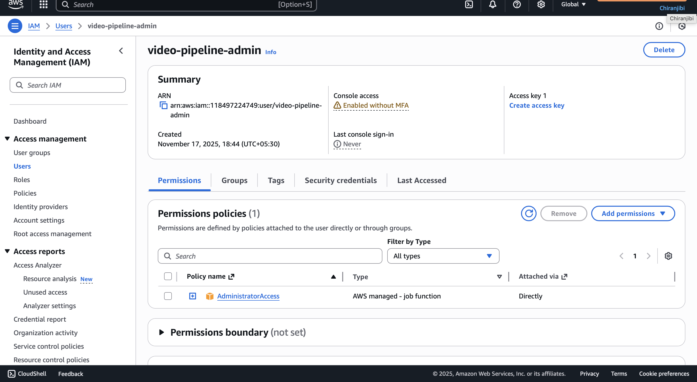
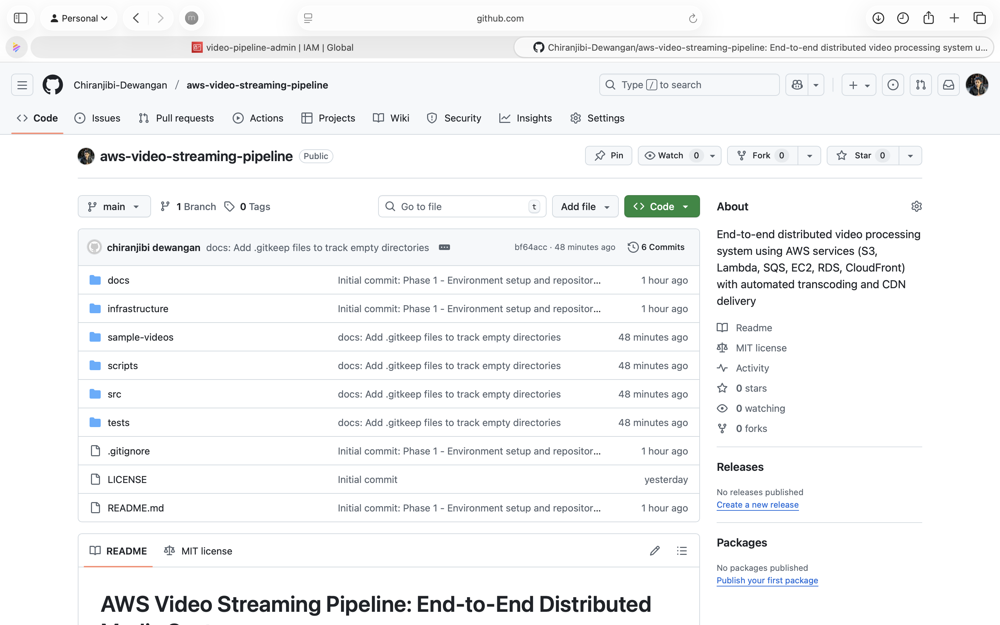

# AWS Video Streaming Pipeline - Portfolio Showcase

## Project Implementation Gallery

This page provides visual documentation of the end-to-end AWS video streaming pipeline implementation.

---

## Phase 1: Foundation & Environment Setup

### Step 1: Billing & Cost Control

*AWS Budget configured to monitor and alert on infrastructure costs*

**Configuration:**
- Budget Name: VideoStreamingPipeline-Budget
- Monthly Limit: $10 USD
- Alert Threshold: 80%

---

### Step 2: IAM Security Setup

*Dedicated IAM user created following AWS security best practices (no root account usage)*

*AdministratorAccess policy attached for development environment*

**User Details:**
- Username: video-pipeline-admin
- Access Type: Console + Programmatic (CLI)

---

### Step 3: CLI Access Keys

*Access keys generated for AWS CLI authentication on local development machine*

---

### Step 4: Development Environment

*AWS CLI successfully installed and authenticated with IAM user credentials*

**Environment Details:**
- AWS CLI: v2.x
- Default Region: us-east-1
- Authenticated User: video-pipeline-admin

---

### Step 5: GitHub Repository

*Professional GitHub repository initialized with comprehensive documentation structure*

---

### Step 6: Project Organization

*Organized project hierarchy with separate directories for infrastructure, code, tests, and documentation*

---

### Step 7: Version Control Baseline

*First commit establishing project baseline with clean commit messages*

---

## Skills Demonstrated

✅ AWS Account Management & Security  
✅ IAM Best Practices & Least Privilege  
✅ AWS CLI Configuration & Usage  
✅ Infrastructure Documentation Standards  
✅ Version Control with Git/GitHub  
✅ Professional Technical Communication  
🔄 Cloud Infrastructure Design *(Phase 2)*  
🔄 Distributed Systems Architecture *(Phase 3)*  
🔄 Media Processing Pipelines *(Phase 3)*  
🔄 Monitoring & Observability *(Phase 4)*  

---

## Next Phases Coming Soon

- **Phase 2**: S3, RDS, SQS, CloudFront, VPC setup
- **Phase 3**: Lambda, EC2, Video transcoding automation
- **Phase 4**: CloudWatch monitoring, cost optimization, final documentation

